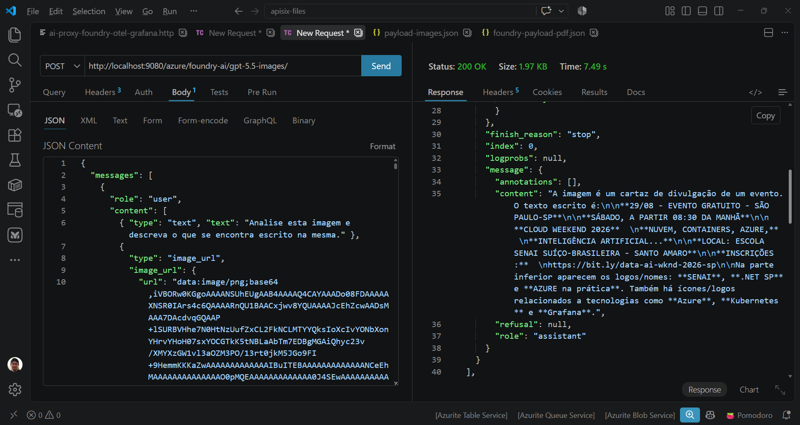
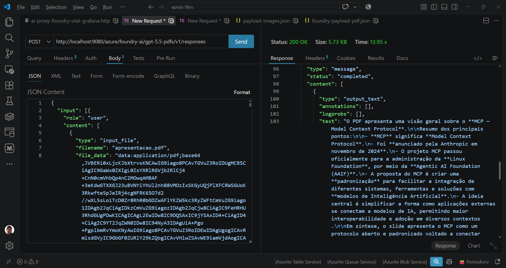
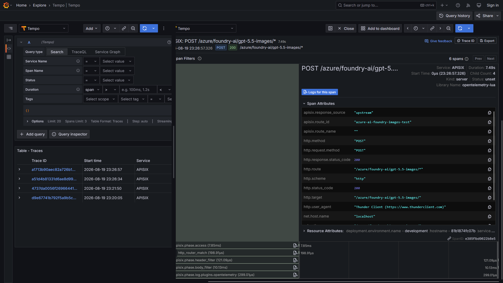

# apisix-ai-gateway-microsoftfoundry-ocr-otel-grafana-prometheus-dockercompose
Scripts do Docker Compose para subida de um ambiente do APISIX com capacidades de AI Gateway. Inclui monitoramento com Grafana + OpenTelemetry + Prometheus, com geração de traces e envio de imagem (.png) e um documento (.pdf) para análise por um modelo multimodal (gpt 5.5).

## Testes - OCR (Optical Character Recognition)

Resultados ao testar uma imagem (arquivo .png):

Resultados ao testar um documento (arquivo .pdf):

Trace gerado por uma dessas requisições:

